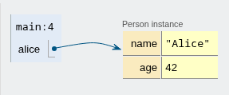

# cs1302-code-visualizer

This project automates the creation of images that visualize a Java program's
state. It also provides a Python interface for doing this.

<table>
<tr>
<td> Code </td> <td> Output </td>
</tr>
<tr>
<td>

```java
public class Main {
  public static void main(String[] args) {
    Person alice = new Person("Alice", 42);
  }
}

record Person(String name, int age) { };
```

</td>
<td>



</td>
</tr>
</table>

## Usage

You should have the [uv package manager](https://docs.astral.sh/uv/) installed.
This program gets source code input from standard input and outputs image data
to standard output. You should use shell input/output redirection.

```console
$ uv run render_image < In.java > out.png
```

To view the execution trace fora program, use the `generate_trace` program (see
`generate_trace --help` for available options):

```console
$ uv run generate_trace < In.java > trace.json
```

To render a visualization using an existing execution trace for a Java program,
use the `generate_visualization` program (see `generate_visualization --help`
for available options):

```console
$ uv run generate_trace < trace.java > out.png
```

To see a list of available breakpoints (i.e., breakpoint line numbers) for Java
program, use the `list_breakpoints` program (see `list_breakpoints --help` for
available options):


```console
$ uv run list_breakpoints < In.java
```

Usage information for the Python interface is provided as docstrings throughout
the package.

## Project overview

This project has three major components: the trace generator, the frontend, the
browser driver.

The trace generator is essentially a Python wrapper around a Java tracer
program. It:
- downloads and installs both [the latest release of the
  tracer](https://github.com/cs1302uga/cs1302-tracer/releases/latest) and the
  latest release of the JDK
- executes the tracer on the input code
- returns the output of the tracer

The frontend is a lightly modified version of OnlinePythonTutor. It is a web
page that takes the trace generated by the Java tracer and turns it into a
visualization.

The browser driver creates a headless Chrome browser process using Selenium,
loads the frontend with the trace, and then takes a screenshot of the
visualization created by the frontend.
