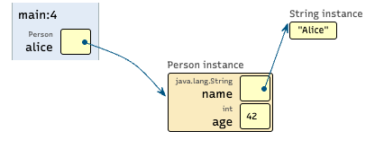

# Code Visualizer (`cs1302-code-visualizer`)

This project automates the creation of images that visualize a Java program's
state. It also provides a Python interface for doing this.

<table>
<tr>
<td> Code </td> <td> Output </td>
</tr>
<tr>
<td>

```java
public class Main {
  public static void main(String[] args) {
    Person alice = new Person("Alice", 42);
  }
}

record Person(String name, int age) { };
```

</td>
<td>



</td>
</tr>
</table>

## Usage

You should have the [uv package manager](https://docs.astral.sh/uv/) installed.
This program gets source code input from standard input and outputs image data
to standard output. You should use shell input/output redirection.

```console
uv run render_image < In.java > out.png
```

To view the execution trace for a program, use the `generate_trace` program (see
`generate_trace --help` for available options):

```console
uv run generate_trace < In.java > trace.json
```

To render a visualization using an existing execution trace for a Java program,
use the `generate_visualization` program (see `generate_visualization --help`
for available options):

```console
uv run generate_visualization < trace.json > out.png
```

To see a list of available breakpoints (i.e., breakpoint line numbers) for Java
program, use the `list_breakpoints` program (see `list_breakpoints --help` for
available options):

```console
uv run list_breakpoints < In.java
```

Usage information for the Python interface is provided as docstrings throughout
the package.

## Project overview

This project has three major components: the trace generator, the frontend, the
browser driver.

The trace generator is essentially a Python wrapper around a Java tracer
program. It:

- downloads and installs both the tracer (uses the URL given in `pyproject.toml`
  if one is given, otherwise falls back to the latest release) and the latest
  release of the JDK
- executes the tracer on the input code
- returns the output of the tracer

The frontend is a lightly modified version of OnlinePythonTutor. It is a web
page that takes the trace generated by the Java tracer and turns it into a
visualization.

The browser driver creates a headless Chrome browser process using Selenium,
loads the frontend with the trace, and then takes a screenshot of the
visualization created by the frontend.

When making a new release, make sure that the version of the tracer program that
you want to use is specified in the `tool.cs1302-code-visualizer` object of
`pyproject.toml`.

## Reusing browsers and execution traces

For repeated image requests, own a `RenderingSession` for the duration of a build:

```python
from cs1302_code_visualizer import RenderingSession, render_images

with RenderingSession(max_browsers=2) as session:
    images = render_images(java_source, {3, 4, 5}, session=session)
    larger_images = render_images(java_source, {3, 4, 5}, dpi=2, session=session)
```

By default, sessions reuse only Chrome: each request still executes Java. To opt
into trace caching separately, set `cache_traces=True` for memory-only caching or
provide `cache_dir=Path(".cache/traces")` for persistent caching (import `Path`
from `pathlib`). Trace keys include all execution arguments, the JDK release identity, and the tracer URL and checksum. Different
breakpoint selections, accumulated occurrences, and full traces remain distinct.
With `cache_traces=True` and no `cache_dir`, trace reuse lasts only for that
session. Failed execution requests are not cached, and damaged cache entries are regenerated.

The session leases browsers exclusively, keeps at most `max_browsers` alive across
all DPI settings, and discards a browser after a failed render or viewport reset,
without retrying the request. Reuse requires matching DPI, headless, and debug
settings. The next request replaces a discarded browser. Each request loads
a fresh frontend document. Exiting the context closes browsers, including after an
exception. A virtual viewport reproduces the existing two-pass window fitting,
including the browser's measured minimum dimensions and chrome offsets. This
preserves wrapping and connector placement while avoiding native resize stalls
during direct diagram capture. Tests require identical image dimensions and
decoded pixels against fresh-browser capture in the same Chrome environment. Existing calls without a session continue
to own and close a browser per image.

Rendering tests opt in by requesting the `rendering_session` fixture and passing
it as `session=rendering_session` to `generate_image` or `generate_step_images`.
The fixture owns one browser per pytest worker and closes it at worker teardown;
it does not cache traces. Use only rendering APIs with this fixture. Tests that
access raw WebDriver, change browser configuration, or verify lifecycle behavior
must own fresh browsers. Each render reloads the frontend and resets viewport
emulation; this contract covers the local renderer, not arbitrary browser state
from applications or raw WebDriver operations. Sessions do not span processes or
separate runs.

To measure browser reuse independently of Java execution and trace caching:

```sh
python -m scripts.benchmark_rendering small-trace-examples/example0/Driver.java.json --requests 6
```

The benchmark reports elapsed time and Chrome launches, and fails if image
sizes or decoded pixels differ between fresh and reused browsers.

Persistent traces are not removed automatically. Use
`cs1302_code_visualizer.session.prune_trace_cache(cache_dir)` to remove entries
unused for 30 days, or delete the cache directory to force retracing. The pruning
function accepts `max_age_days` and `dry_run` and returns file and byte counts.
