# Array orientation

Java arrays support horizontal and vertical layouts. Vertical arrays transpose the index/value table: indices run down the left column, values down the right. The type and length label stays above the table; empty arrays retain the existing empty box.

## Frontend configuration

Pass options to `CodeVisualizer.create({ lang: "java", trace, element, options })`:

```ts
const options = {
  arrayOrientation: "horizontal",     // default; or "vertical"
  alternateArrayOrientations: false,  // default
  arrayOrientations: { "42": "vertical" }, // optional heap object ID overrides
};
```

Resolution order:

1. A valid per-object override wins.
2. With alternation enabled, `arrayOrientation` specifies the 1D orientation. Every additional dimension flips that orientation: the default base produces horizontal / vertical / horizontal / vertical for ranks 1–4.
3. Otherwise all arrays use the base orientation.

Rank comes from the array object's type metadata (`int[][]`, for example), independently of which variable or parent references it. Ragged lengths do not change rank. A parent's override does not propagate to its children. Shared objects receive one consistent orientation, including across forward/backward stepping. Overrides are scoped to one visualizer and keyed by trace heap object IDs, not variable names.

Legacy untyped arrays use the base when rank is unavailable. A missing or invalid base orientation falls back to horizontal. Invalid per-object settings are ignored. Collections such as `ArrayList`, stacks, and queues keep their existing presentation. No interactive toggles are added. Python and CLI options are described below.

The `render-trace.html` entry point accepts the same names as URL parameters. `arrayOrientations` is a JSON object; use `URLSearchParams` to encode it:

```js
const params = new URLSearchParams({
  tracePath: "/absolute/path/to/trace.json",
  arrayOrientation: "horizontal",
  alternateArrayOrientations: "true",
  arrayOrientations: JSON.stringify({ "42": "vertical" }),
});
// Append `?${params}` to the render-trace.html URL.
```

## CLI and Python configuration

All three rendering commands accept the same array flags. Defaults match the frontend: horizontal base, alternation off, no per-object overrides.

```sh
# Render Java source with alternating dimensions.
uv run code-visualizer Main.java -o main.png --alternate-array-orientations

# Render an existing trace vertically, except for heap object 4.
uv run generate_visualization --array-orientation vertical \
  --array-orientation-for 4=horizontal -o arrays.png < trace.json

# Generate an HTML embed with alternating dimensions.
uv run render_html --alternate-array-orientations < trace.json > arrays.html
```

`--array-orientation horizontal|vertical` sets the base (and 1D) orientation. `--alternate-array-orientations` enables alternation. Repeat `--array-orientation-for HEAP_ID=horizontal|vertical` for individual objects; the last occurrence of an ID wins. These options also work with `generate_visualization --html`, `--all-steps`, and `code-visualizer --batch`.

HTML embeds must load a frontend bundle that supports these options. When using these changes before release, pass `--bundle-url` pointing to the built `vis-module.bundle.js` served alongside your page. Screenshot commands use the local bundled frontend.

Heap IDs belong to the trace, not source variable names. Overrides for absent IDs are ignored, including at steps before an array is allocated. Collections and `json-pre` output retain their existing presentation. Invalid flag values fail argument parsing before tracing or rendering.

Batch manifest fields are top-level snake_case values:

```json
{"id":"one","source":"class Main { public static void main(String[] args) {} }","array_orientation":"vertical","alternate_array_orientations":false,"array_orientations":{"4":"horizontal"}}
```

Each omitted field inherits the CLI setting. An explicit `false` disables inherited alternation. Per-object maps merge, with job entries winning for matching IDs; an empty map adds no overrides. A malformed array setting anywhere in the manifest fails validation, with its line number, before any job traces or renders, even with `--keep-going`. Use JSON booleans and an object map, not strings or `null`.

The Python APIs `render_image`, `render_images`, `BatchRenderJob`, `generate_image`, `generate_step_images`, and `render_html` accept the same snake_case fields:

```python
from cs1302_code_visualizer import render_html

html = render_html(
    trace,
    array_orientation="horizontal",
    alternate_array_orientations=True,
    array_orientations={"42": "vertical"},
)
```

Array presentation does not alter execution traces or trace-cache keys. Settings are passed on each render, including when a browser is reused.

## Before and after

Baseline revision: `19d53bfc4edb75d254c1d378883c4b302bd964df`.
The before images were captured from a freshly built, unmodified baseline before implementation. All images use the same browser window (1280 × 1200), device scale (1), capture width (1200), fixtures, and execution steps. Fonts finish loading and reference connectors redraw before capture. Captured with Chrome `153.0.8010.48`.

All four default before/after pairs (two fixtures × two steps) are pixel-identical.

| Baseline | Updated, default options |
| --- | --- |
| 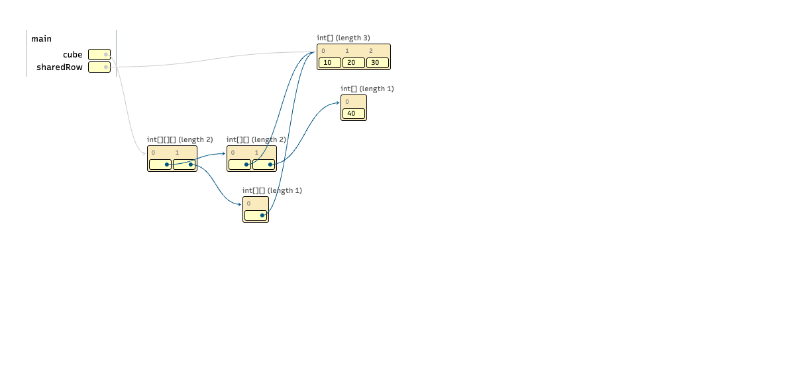 |  |
| 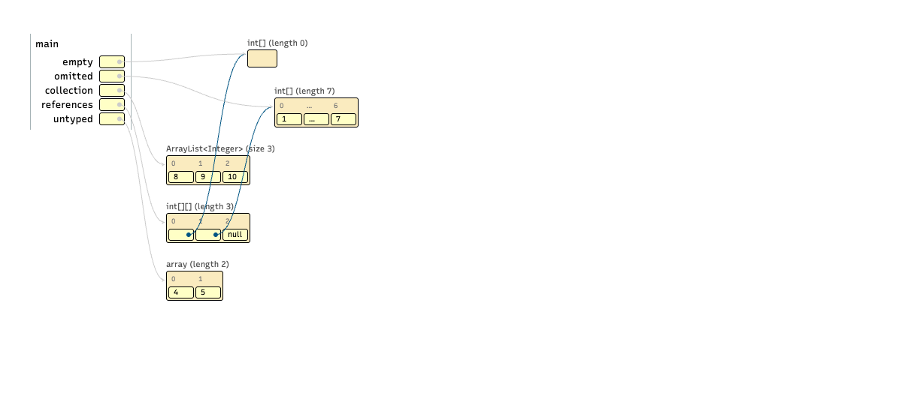 |  |

## Configuration gallery

The dimensional fixture has a 3D array (ID `1`), two ragged 2D arrays (`2`, `3`), and 1D arrays (`4`, `5`). Both 2D arrays reference row `4`, which is also referenced by a local variable. These screenshots all show step 0.

### Horizontal

```json
{}
```


### Vertical

```json
{
  "arrayOrientation": "vertical"
}
```

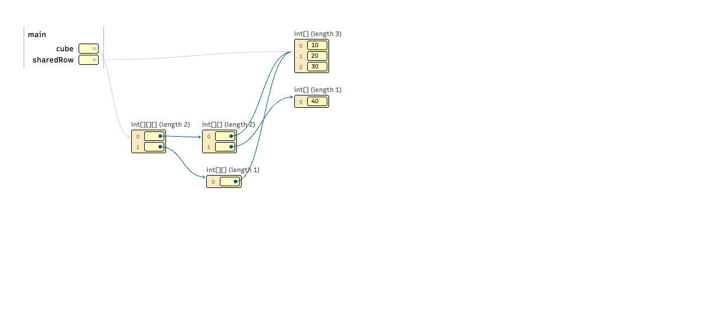

### Alternate horizontal

```json
{
  "alternateArrayOrientations": true
}
```

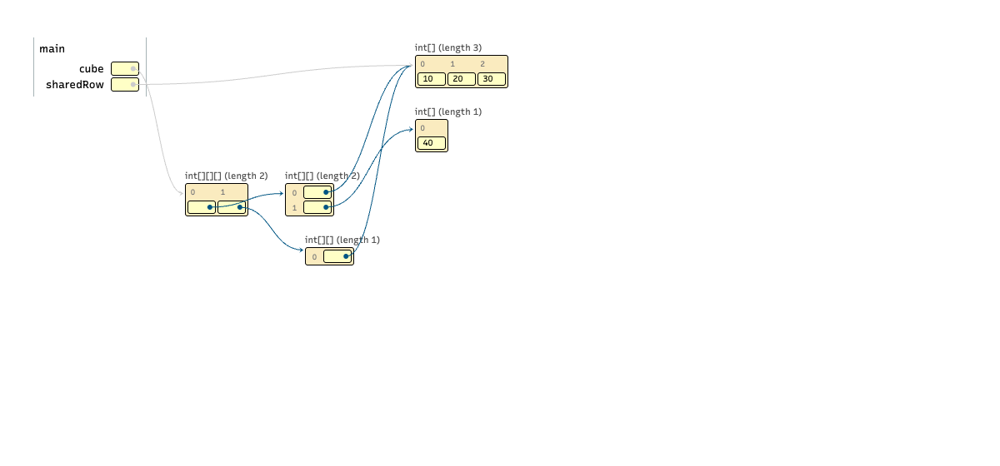

### Alternate vertical

```json
{
  "arrayOrientation": "vertical",
  "alternateArrayOrientations": true
}
```

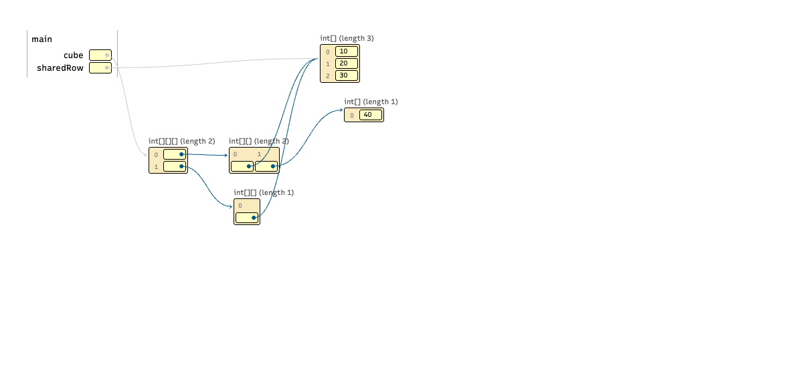

### Horizontal override

```json
{
  "arrayOrientations": {
    "4": "vertical"
  }
}
```

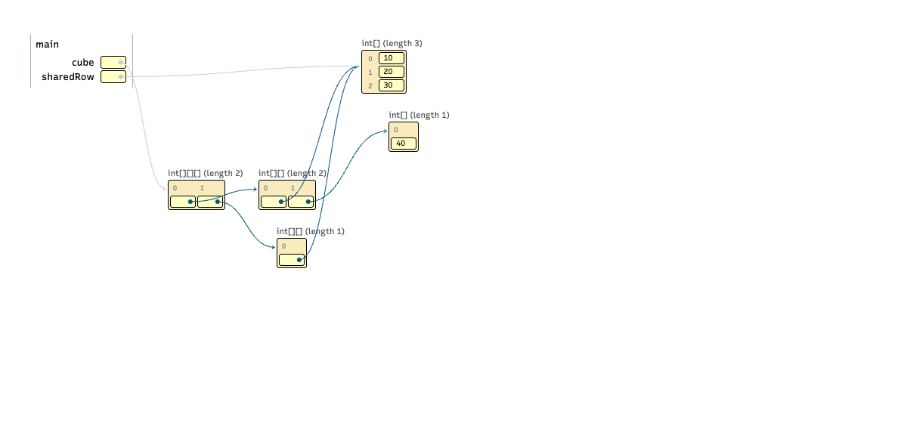

### Vertical override

```json
{
  "arrayOrientation": "vertical",
  "arrayOrientations": {
    "4": "horizontal"
  }
}
```

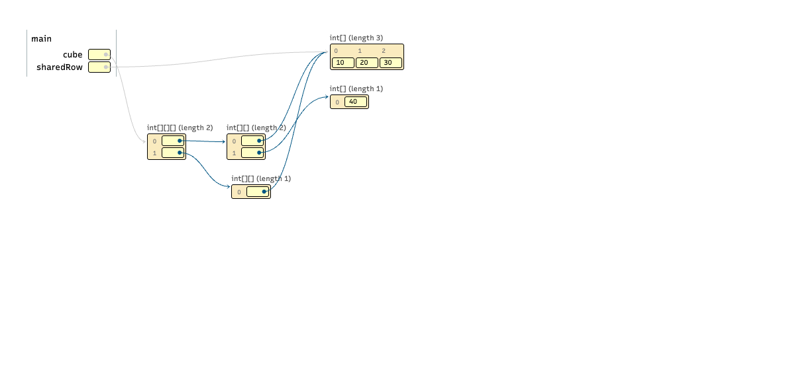

### Alternate horizontal override

```json
{
  "alternateArrayOrientations": true,
  "arrayOrientations": {
    "2": "horizontal"
  }
}
```

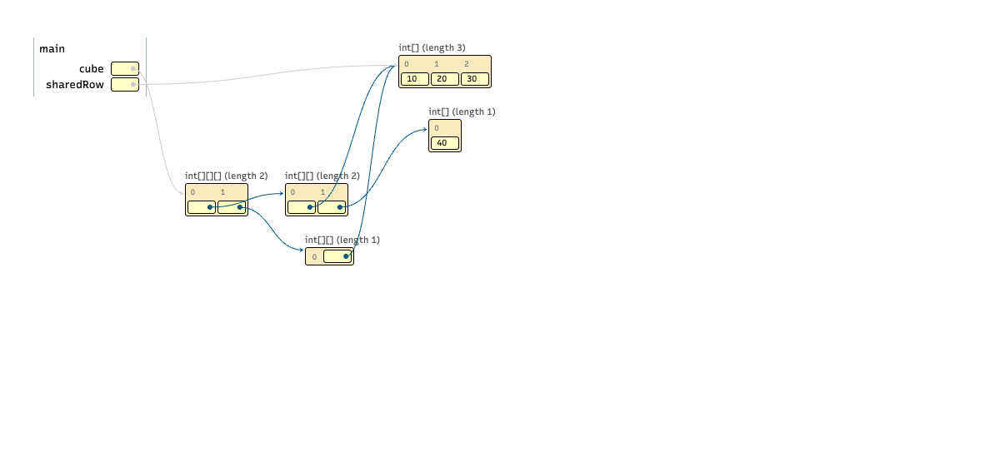

### Alternate vertical override

```json
{
  "arrayOrientation": "vertical",
  "alternateArrayOrientations": true,
  "arrayOrientations": {
    "2": "vertical"
  }
}
```

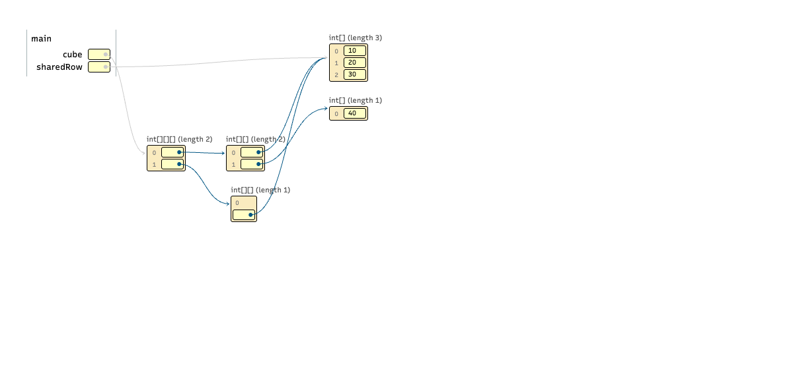

## Edge cases and stepping

Vertical mode preserves the empty array box, the elision marker and subsequent index `6`, null references, and ordinary reference arrows. The collection remains horizontal. The untyped array uses the configured base.

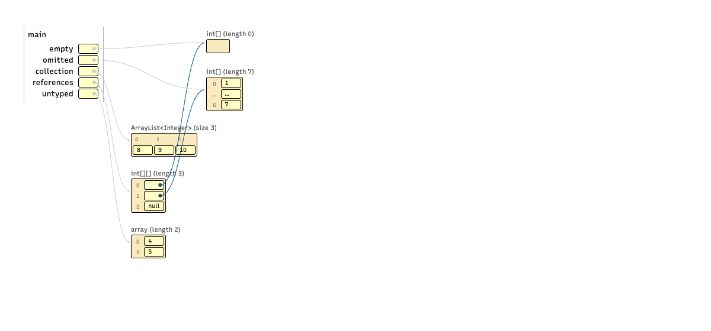

With alternation enabled, the 2D reference array is vertical while its 1D targets remain horizontal:

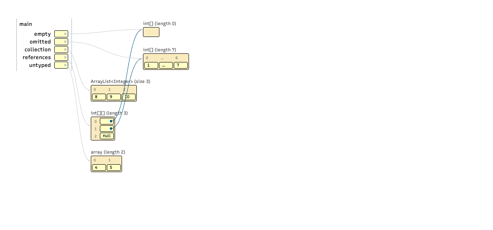

The shared 1D row changes from `[10, 20, 30]` to `[10, 99, 30]`. Orientations remain stable:

| Step 0 | Step 1 |
| --- | --- |
|  | 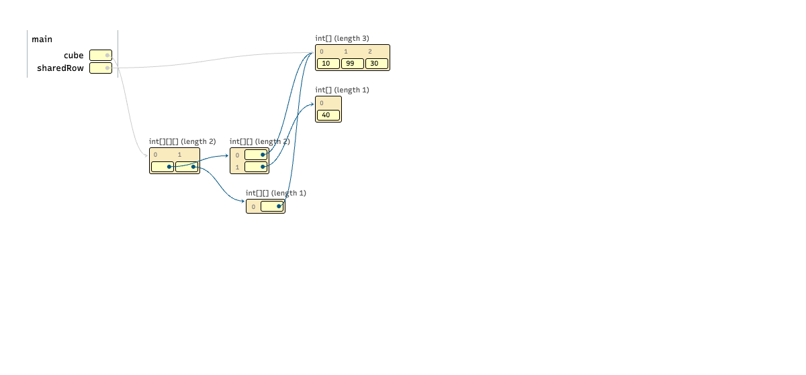 |

The edge fixture also changes its final visible value from `7` to `70`:

| Step 0 | Step 1 |
| --- | --- |
|  |  |

The existing connector routing can cross unrelated objects in this fixture, including in the baseline. This change preserves that routing; arrow endpoints remain attached to their source cells and target objects.

## Validation

- All 436 Python tests pass with 100% coverage, including 36 new array-option tests for CLI propagation, batch precedence, invalid input, Python APIs, and browser rendering across steps.
- Repository lint, type checks, dependency checks, and Python distribution builds pass.
- All 55 frontend tests pass, including all eight combinations, forward/backward stepping, shared references, collections, elision, missing metadata, modern traces, 4D rank, and separate visualizer instances.
- The production build succeeds with the existing webpack bundle-size warnings.
- All eight combinations also pass real-browser checks through `render-trace.html` URL options.
- All four default before/after pairs are pixel-identical; all 26 screenshots were captured without browser console errors.
- Visual review covered the configuration matrix, edge cases, and arrow attachment. Existing connector crossings are described above.

## Reproduce

From the repository root, build and test:

```sh
npm --prefix cs1302_code_visualizer/frontend ci
npm --prefix cs1302_code_visualizer/frontend test
npm --prefix cs1302_code_visualizer/frontend run build
uv run --no-project --with selenium python docs/array-orientation/capture.py --phase after
```

Chrome must be installed; Selenium locates/downloads a compatible driver. The capture script renders the actual production bundle using the committed fixtures. It writes 22 after screenshots (eight dimensional configurations and three edge configurations, each at two steps). Browser console errors fail capture. [after-captures.json](after-captures.json) records each image's options, fixture, and step.

To reproduce the baseline, build the baseline revision in a separate checkout, then run this checkout's capture script against that build:

```sh
uv run --no-project --with selenium python docs/array-orientation/capture.py \
  --phase before --build /path/to/baseline/cs1302_code_visualizer/frontend/build
```

This writes four before images. Use the same Chrome version for pixel comparisons. [before-captures.json](before-captures.json) records the baseline captures. The fixtures and capture script are shared with the after captures; only the built frontend changes.
