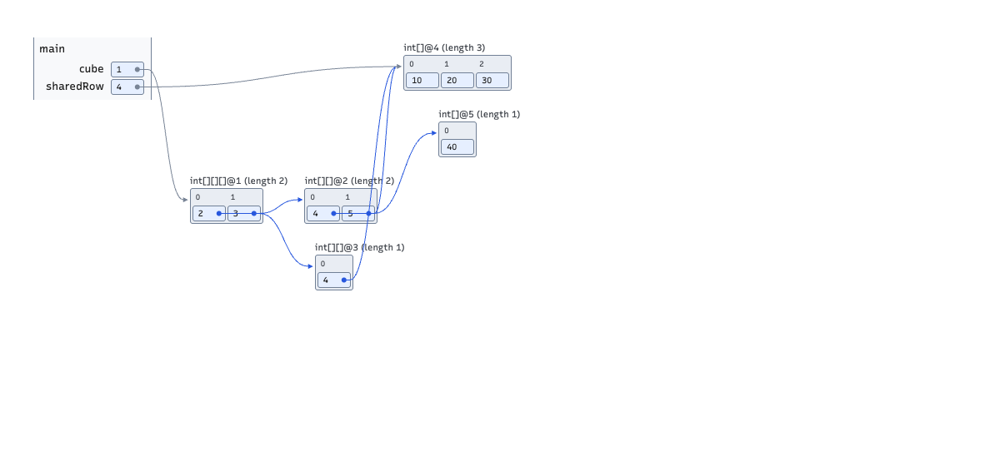
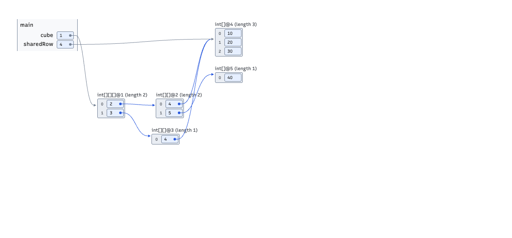
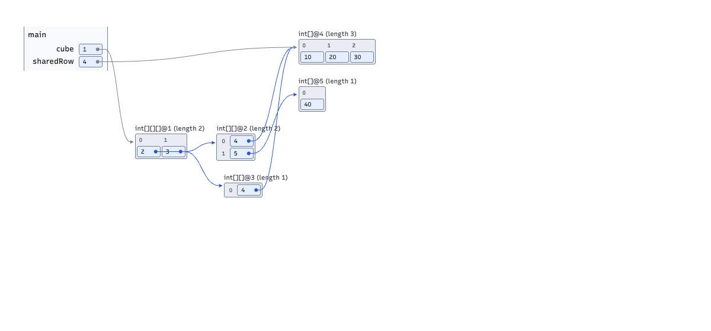
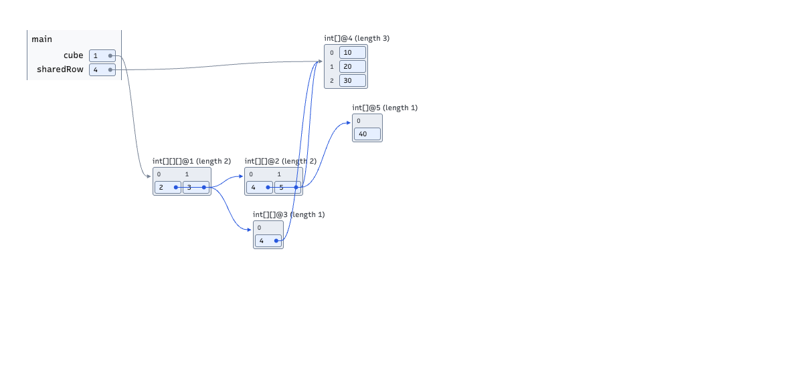
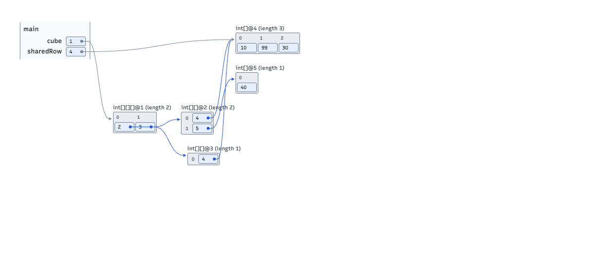
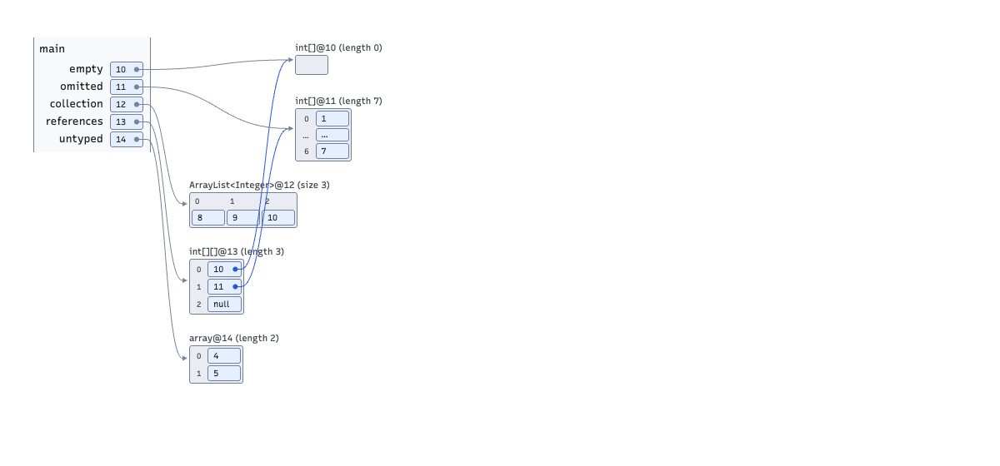

# Array orientation

Java arrays support horizontal and vertical layouts. Vertical arrays transpose the index/value table: indices run down the left column, values down the right. The type and length label stays above the table; empty arrays retain the existing empty box.

## Frontend configuration

Pass options to `CodeVisualizer.create({ lang: "java", trace, element, options })`:

```ts
const options = {
  arrayOrientation: "horizontal",     // default; or "vertical"
  alternateArrayOrientations: false,  // default
  arrayOrientations: { "42": "vertical" }, // optional heap object ID overrides
};
```

Resolution order:

1. A valid per-object override wins.
2. With alternation enabled, `arrayOrientation` specifies the 1D orientation. Every additional dimension flips that orientation: the default base produces horizontal / vertical / horizontal / vertical for ranks 1–4.
3. Otherwise all arrays use the base orientation.

Rank comes from the array object's type metadata (`int[][]`, for example), independently of which variable or parent refers to it. Ragged lengths do not change rank. A parent's override does not propagate to its children. Shared objects receive one consistent orientation, including across forward/backward stepping. Overrides are scoped to one visualizer and keyed by trace heap object IDs, not variable names.

Legacy untyped arrays use the base when rank is unavailable. A missing or invalid base orientation falls back to horizontal. Invalid per-object settings are ignored. Collections such as `ArrayList`, stacks, and queues keep their existing presentation. No interactive toggles are added. Python and CLI options are described below.

The `render-trace.html` entry point accepts the same names as URL parameters. `arrayOrientations` is a JSON object; use `URLSearchParams` to encode it:

```js
const params = new URLSearchParams({
  tracePath: "/absolute/path/to/trace.json",
  arrayOrientation: "horizontal",
  alternateArrayOrientations: "true",
  arrayOrientations: JSON.stringify({ "42": "vertical" }),
});
// Append `?${params}` to the render-trace.html URL.
```

## CLI and Python configuration

All three rendering commands accept the same array flags. Defaults match the frontend: horizontal base, alternation off, no per-object overrides.

```sh
# Render Java source with alternating dimensions.
uv run code-visualizer Main.java -o main.png --alternate-array-orientations

# Render an existing trace vertically, except for heap object 4.
uv run generate_visualization --array-orientation vertical \
  --array-orientation-for 4=horizontal -o arrays.png < trace.json

# Generate an HTML embed with alternating dimensions.
uv run render_html --alternate-array-orientations < trace.json > arrays.html
```

`--array-orientation horizontal|vertical` sets the base (and 1D) orientation. `--alternate-array-orientations` enables alternation. Repeat `--array-orientation-for HEAP_ID=horizontal|vertical` for individual objects; the last occurrence of an ID wins. These options also work with `generate_visualization --html`, `--all-steps`, and `code-visualizer --batch`.

HTML embeds must load a frontend bundle that supports these options. When using these changes before release, pass `--bundle-url` pointing to the built `vis-module.bundle.js` served alongside your page. Screenshot commands use the local bundled frontend.

Heap IDs belong to the trace, not source variable names. Overrides for absent IDs are ignored, including at steps before an array is allocated. Collections and `json-pre` output retain their existing presentation. Invalid flag values fail argument parsing before tracing or rendering.

Batch manifest fields are top-level snake_case values:

```json
{"id":"one","source":"class Main { public static void main(String[] args) {} }","array_orientation":"vertical","alternate_array_orientations":false,"array_orientations":{"4":"horizontal"}}
```

Each omitted field inherits the CLI setting. An explicit `false` disables inherited alternation. Per-object maps merge, with job entries winning for matching IDs; an empty map adds no overrides. A malformed array setting anywhere in the manifest fails validation, with its line number, before any job traces or renders, even with `--keep-going`. Use JSON booleans and an object map, not strings or `null`.

The Python APIs `render_image`, `render_images`, `BatchRenderJob`, `generate_image`, `generate_step_images`, and `render_html` accept the same snake_case fields:

```python
from cs1302_code_visualizer import render_html

html = render_html(
    trace,
    array_orientation="horizontal",
    alternate_array_orientations=True,
    array_orientations={"42": "vertical"},
)
```

Array presentation does not alter execution traces or trace-cache keys. Settings are passed on each render, including when a browser is reused.

## Configuration gallery

The dimensional fixture has a 3D array (ID `1`), two ragged 2D arrays (`2`, `3`),
and 1D arrays (`4`, `5`). Both 2D arrays refer to row `4`, which is also referred to
by a local variable. These examples use the production renderer.

| Configuration | Example |
| --- | --- |
| Default horizontal |  |
| `arrayOrientation: "vertical"` |  |
| `alternateArrayOrientations: true` |  |
| `arrayOrientations: { "4": "vertical" }` |  |

The shared row changes from `[10, 20, 30]` to `[10, 99, 30]` at the next step;
its orientation remains stable:



Vertical mode preserves empty arrays, elision and subsequent indices, nulls,
and reference arrows. Collections keep their existing layout, and untyped arrays
use the configured base orientation:



## Regenerate examples

From the repository root:

```sh
npm --prefix cs1302_code_visualizer/frontend ci
make build-frontend
uv run python docs/array-orientation/capture.py
```

Chrome must be installed. The capture script renders these six examples from the
committed fixtures and production bundle. Browser console errors fail capture.
The dimensional fixture also supports automated regression tests; retain it when
editing the gallery. See [known exceptions](../known-exceptions.md) for validation
limitations.
