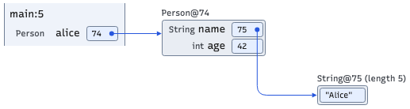

# Reading a memory diagram

A diagram is a snapshot of the captured execution state. It shows variables and
objects, not the physical arrangement of memory or the history of every change.

## Start with the quickstart

In this example, follow the arrow from `alice` to the `Person` object. Its `age`
field holds the integer `42`; its `name` field refers to the String containing
`"Alice"`. The numbers inside reference boxes identify objects in this trace;
they are not the values of `age` or `name`.

## Visual key

| Element | How to read it |
| --- | --- |
| Stack frame, such as `main:5` | A method invocation and its displayed source-line context. Rows show its visible variables. The line label is a source line, not an execution-step count. |
| Variable or field row | The name identifies the variable or field; an optional type label gives its declared type. The value box contains a primitive value, `null`, or an object reference. |
| Heap object, such as `Person@92` | The concrete runtime class and trace object ID. IDs identify objects within the trace; they are not memory addresses or Java identity hash codes and may change between runs. |
| Dot, shaft, and arrowhead | Start at the dot in the reference box and follow the shaft to its arrowhead at the target. Curves and detours are layout choices, not intermediate operations. |
| Several arrows to one object | Aliases: different variables or fields refer to the same object, rather than separate copies. Matching reference IDs also indicate shared identity. |
| Arrow back to an earlier object or itself | A cycle or self-reference. Follow the arrowhead; left-to-right position does not determine the direction of the relationship. |
| `null` | No object reference, so there is no target arrow. It is distinct from the string `"null"`. |
| Array | The label gives its type, ID, and length. Indexed cells hold values or references; changing horizontal/vertical orientation does not change index order or contents. |

The highlighted stack-frame background marks the active frame. Blue references
originate in that frame or in heap objects; muted references originate in
suspended/inactive frames. Muting does not mean an object is unreachable or ready
for garbage collection. Use labels, source boxes, and arrowheads to establish
identity rather than relying on color alone.

Arrows prefer routes around other objects and protect visible text. A crossing
in clear space is not a connection between the arrows, and passing near a box
does not make it the target. Detours can enlarge the image while object placement
and text size remain unchanged. See [reference routing](reference-routing/README.md).

## Strings and presentation options

- `default`: a reference points to a separate String object containing the literal.
  Its label ends with `(length N)`, using Java’s UTF-16 code-unit count.
- `compact`: the reference ID and a short arrow appear beside the literal. A shared
  literal may be repeated visually while retaining the same reference ID.
- `inline`: the literal appears in the value box. This presentation emphasizes
  the value; use default or compact when teaching String reference identity.

See [string styles](string-style/README.md) for examples. `--no-types` hides declared
types, while heap class labels remain. `--text-memory-labels` replaces persistent
arrows and dots with textual reference IDs; match those IDs to object labels.
Interactive hover behavior may still reveal arrows to visible heap objects.

A snapshot can omit fields, variables, or objects because of filtering and
presentation settings. Do not infer that omitted content never existed. When
comparing steps, use object identity and values rather than screen position.
See [execution-step selection](../README.md#choose-execution-steps) and
[array layout](array-orientation/README.md) for the relevant options.

For text alternatives, light/dark colors, and the scope of WCAG claims, see
[accessibility](accessibility.md).

Type names, including generic parameters, stay on one line. Interactive diagrams
reserve declared-type column space across all supplied execution states; snapshot
and breakpoint batches reserve it across the requested states. This can widen a
diagram without changing the text size. Compact and inline string labels keep
their existing presentation. ArrayList capacity is not displayed.
