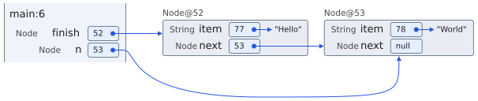

# Reference-arrow routing

Reference arrows prefer clear routes around heap objects while protecting all
visible text, including complete compact string literals. Crossings through
empty object interiors are allowed when needed for a readable route. Arrows
retain their source and target identities in every string style.

Sources may leave through the top, right, or bottom of their reference box.
The complete route is checked for source-box re-entry, including rounded corners;
a rightward stub cannot reverse back through the source and leave left.
Arrowheads and hover stroke widths participate in clearance checks.

## Example: reference to a later node

[Main.java](Main.java) creates two nodes, then assigns `n` to the second node.
Capture line 6, after that assignment, with compact strings:

```sh
uv run code-visualizer docs/reference-routing/Main.java -b 6 \
  --string-style compact --format SVG -o .scratch/reference-routing/compact.svg
```

The command assumes a checkout with the frontend built; see
[the contributor guide](../../CONTRIBUTING.md). Use `--format PNG` and a `.png`
output filename for a raster image. Replace `compact` with `inline` or `default`
to compare string styles at the same execution state.



The source boxes and nodes retain their positions; the route grows the diagram's
bounds instead of shrinking its text. This is a representative current export,
not a guarantee about every graph. Reference IDs can differ between tracer runs.

## Implementation

`frontend/js/connectorRouting.ts` measures DOM geometry once per routing pass
and caches routes by geometry and maximum paint width. `referenceRouting.ts`
retains suitable curves, tries broad sweeps and orthogonal detours, then searches
an expanding visibility grid. `connectorGeometry.ts` supplies shared source-dot
and arrowhead dimensions to both the routing checks and the painted connectors.

Text clearance is 1 CSS pixel plus stroke extent. Preferred object clearance is
8 pixels; broad curves begin 32 pixels below relevant objects. Aliases use
separate arrival ports and additional lanes. These are internal routing values,
not public configuration options. Identical geometry and rendering settings
produce identical routes without using navigation history.

Routing preserves placement first. If fixed-position candidates fail, it can
move an object covering a source dot or widen a crowded source or target, then
remeasure the diagram. Repairs are undone and recomputed on each routing pass.
Externally constrained CSS can prevent repair and produce a diagnostic; the
renderer does not silently restore a text-crossing route. Arbitrary dense graphs
still require visual review for traceability.

Interactive padding and export bounds include detours without reducing text size.
Regression tests and measured fixtures live in `frontend/tests/`. Temporary
prototypes, review PDFs, browser captures, benchmark results, and security scans
belong in the ignored root `.scratch/` directory, as required by
[the development-artifact policy](../../CONTRIBUTING.md#development-artifacts).

## Validation and performance

Run the geometry regressions from the repository root:

```sh
npm --prefix cs1302_code_visualizer/frontend test -- tests/svgConnectors.test.ts
```

The [fixture replay helper](../../cs1302_code_visualizer/frontend/tests/routingFixture.ts)
uses captured DOM rectangles with the production connector manager. Tests cover
text clearance, source exits and re-entry, cycles, aliases, string styles,
repair, and deterministic redraws. Keep browser/export checks as well: mocked
rectangles alone do not validate fonts, CSS, painted stroke extents, or cropping.
After rebuilding the frontend, run the selected native export checks with:

```sh
uv run pytest --no-cov tests/test_export_cropping.py tests/test_svg_export.py
```

Coverage is disabled only for that selected subset; the repository-wide gate
still applies to the complete Python suite. For visual review, inspect shafts,
dots, arrowheads, and hover widths at native size and reduced zoom. Require clear
text, permitted source exits, distinguishable arrivals, deterministic redraws,
and complete SVG/PNG bounds. Ordinary crossings are acceptable when each path
remains easy to follow; sampled curve points supplement conservative geometry
checks rather than replacing them. See the [SVG review guide](../svg-gallery.md).

The [browser benchmark](../../scripts/benchmark_reference_routing/README.md)
retains the representative traces and dense-scene generator. The agreed budgets
on the measured browser/hardware are:

| Metric | Budget |
| --- | ---: |
| Representative fixtures: p95 full redraw | 16 ms |
| 48 objects / 108 references: p95 full redraw | 50 ms |
| 48 objects / 108 references: maximum fresh layout | 300 ms |

A full redraw includes value-box layout. Fresh layout creates a new visualizer
with warm assets; it does not measure cold loading or a complete execution-step
transition. Record browser, hardware, viewport, and sampling protocol with new
results. These budgets are comparison targets on a controlled environment, not
guarantees for every device. Keep measurements and review reports in `.scratch/`.
