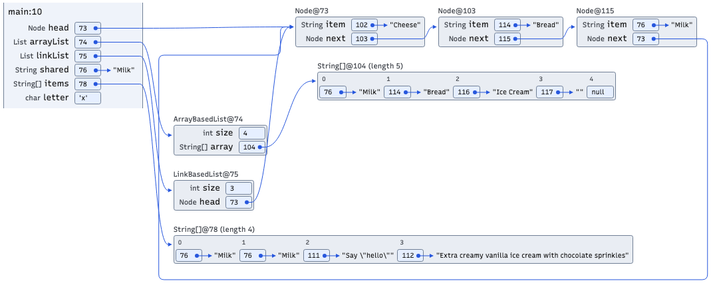

# String styles

Every rendering entry point accepts a string presentation setting:

| Style | Presentation |
| --- | --- |
| `default` | A reference box points to a separate String heap object. |
| `inline` | The string literal appears inside the value box. |
| `compact` | The reference box points horizontally to the literal beside it, inside the enclosing frame, object, or array component. |

Compact repeats shared literals locally while keeping the same reference ID.
Literals remain complete, including long strings. Null has no arrow. Heap objects
are labelled with their concrete class and trace ID, for example `Node@73` or
`String[]@104 (length 5)`. These IDs are not Java identity hash codes.

```python
from cs1302_code_visualizer import StringStyle, render_image, render_images

style: StringStyle = "compact"
image = render_image(source, string_style=style, format="SVG")
images = render_images(source, {10, 15}, string_style=style)
```

`BatchRenderJob`, `generate_image`, `generate_step_images`,
`generate_snapshot_images`, and `render_html` also accept `string_style`.
JavaScript embedding uses `options: { stringStyle: "compact" }` with
`CodeVisualizer.create`. The direct rendering page accepts `stringStyle` in its
query string. The bundled quick tester includes a style selector.

```python
from cs1302_code_visualizer import render_html

snippet = render_html(trace_json, string_style="compact", theme="light")
```

All styles share aligned 19 px value boxes, left-aligned reference values,
consistent arrowheads, and external return routes for cycles. `include_types=False`
hides declared variable/field types but keeps heap class labels.
`text_memory_labels=True` suppresses persistent arrows and source dots; compact
still shows reference values beside literals. Existing hover arrows remain for
references to visible heap objects.

## Migration and release notes

The effective default is now `string_style="default"` everywhere. This changes
omitted-option behavior for `render_images` and `BatchRenderJob`, which previously
inlined strings by default. Pass `string_style="inline"` to retain that presentation.

| Deprecated rendering argument | Replacement |
| --- | --- |
| `inline_strings=False` | `string_style="default"` |
| `inline_strings=True` | `string_style="inline"` |

Explicit use of the old argument emits `DeprecationWarning`. Supplying both
arguments raises `TypeError`, even if they agree. Compatibility signatures use a
private omitted-value sentinel to distinguish omission from explicit `"default"`.
The deprecated rendering argument remains available throughout the current major
version and will be removed in the next major after at least one warning-bearing
release.

Rendering now generates identity-preserving traces for all styles. Trace-only
`generate_trace` and `BatchTraceJob` retain `inline_strings` as a serialization
control. A legacy trace that discarded string identities can render only with
`inline`; regenerate it with `inline_strings=False` to use `default` or `compact`.
The renderer reports this requirement instead of inventing reference IDs.

## Review and reproducibility

Serve the repository root and open `docs/string-style/index.html` to compare all
styles, themes, orientations, declared types, and text-only references. This page
uses the production bundle and the real tracer output in `fixtures/lists.json`.
`fixtures/Lists.java` is a small memory-layout fixture with the course classes,
shared strings, a three-node cycle, empty/quoted/long strings, and a char.
The snapshot is at line 10. Regenerate it with `generate_trace(...,
breakpoints={10}, inline_strings=False)`.

## Production examples



- [Compact, vertical arrays and dark theme](images/compact-vertical-dark.png)
- [Default: separate string objects](images/default-horizontal-light.png)
- [Inline string literals](images/inline-horizontal-light.png)
- [Editable compact SVG](images/compact-horizontal-light.svg)

Run `uv run python docs/string-style/capture.py` from the repository root to
regenerate these examples. See [known exceptions](../known-exceptions.md) for
compatibility and validation limitations.
