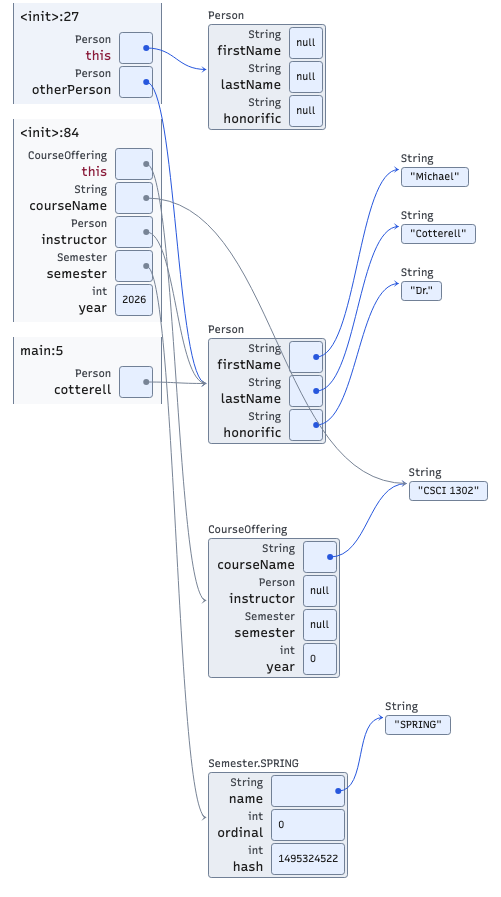
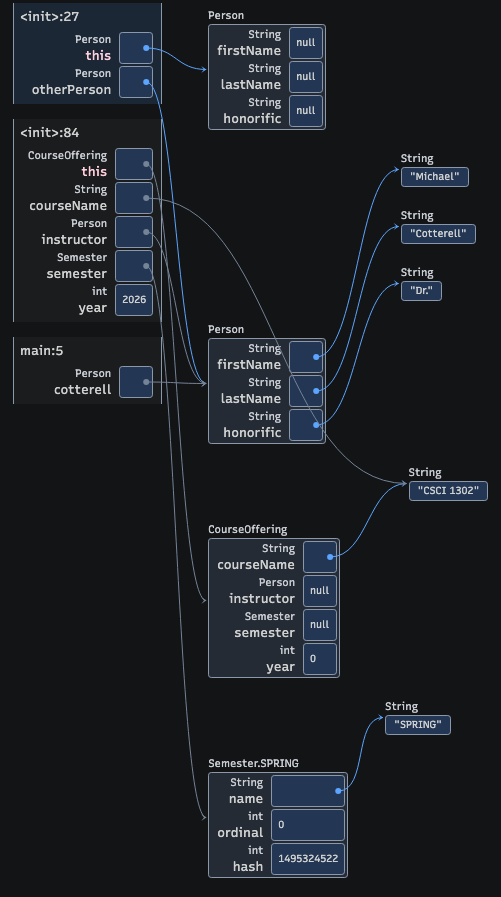

# Visualization themes

Use the light palette for light pages and print material, and the dark palette for dark pages. For a page with its own theme selector, export SVG without a theme option and embed its markup inline. This lets the diagram follow the page's choice.

Theme support is available in version 0.16.1. Older exports need to be regenerated to include the theme styles and semantic color roles.

## Light and dark examples

Both images show the same state from [example 2](../examples/example2/Driver.java), at line 27 in the `Person` copy constructor. The active `Person` constructor is above the suspended `CourseOffering` constructor and `main` frames.

| Light | Dark |
| --- | --- |
|  |  |

The source of a reference determines its color. References originating in the active stack frame are blue. References originating in an inactive stack frame are muted, including their source dot, line, and arrowhead. Heap-to-heap references stay blue, even when an inactive frame also refers to those objects. Muting does not mean that an object is unreachable or eligible for garbage collection.

The active frame also has a distinct background. Literal Java `Color` swatches and their transparency checkerboards retain their program colors in both themes.

## Choose a theme

The CLI accepts `--theme light`, `--theme dark`, and `--theme auto`. Python rendering APIs accept the corresponding `theme="light"`, `"dark"`, or `"auto"` argument. Omit the option, or use Python's `None`, to allow host-theme inheritance.

| Setting | Standalone SVG in a browser | Inline SVG or interactive visualizer |
| --- | --- | --- |
| Omitted | Light | Follows an ancestor's `data-theme`; light if absent. |
| `light` | Light | Light, overriding the host's theme choice. |
| `dark` | Dark | Dark, overriding the host's theme choice. |
| `auto` | Follows the viewing system's color preference. | Follows the viewing system's color preference, independently of the host's explicit light/dark choice. |

For PNG and other raster output, colors are fixed when the image is rendered. `auto` uses the rendering browser's system preference at that time; it cannot adapt the resulting pixels later. Use an explicit light or dark theme for predictable raster output from a build server.

```sh
code-visualizer Main.java --theme light -o main-light.png
code-visualizer Main.java --theme dark -o main-dark.png
code-visualizer Main.java --format SVG -o main.svg
```

The last command produces an SVG that is light on its own and can follow a host page when embedded inline. Explicit light/dark/Auto exports carry a `data-codevis-theme` attribute on their root SVG element. To restore host inheritance, regenerate without `--theme` or remove that attribute.

## Embed an adaptive SVG

An SVG loaded through `` is a separate image document. It cannot inherit the parent page's `data-theme` attribute or CSS custom properties. An Auto SVG may still respond to its own browser color-scheme environment, but that does not connect it to the page's theme toggle. Embed the SVG markup inline to follow that toggle.

This Python recipe uses `Main.java` from the [quickstart](../README.md#create-your-first-diagram). It writes a complete page with a working theme selector. The generated SVG supplies its own styles; it needs no frontend JavaScript bundle.

```python
from pathlib import Path
from cs1302_code_visualizer import render_image

source = Path("Main.java").read_text(encoding="utf-8")
svg = render_image(source, format="SVG").decode("utf-8")
page = """<!doctype html>
<html lang="en">
<meta charset="utf-8">
<title>Program memory</title>
<style>
  body { background: #ffffff; color: #1e1e1e; }
  body[data-theme="dark"] { background: #131416; color: #cfd0d0; }
  @media (prefers-color-scheme: dark) {
    body[data-theme="auto"] { background: #131416; color: #cfd0d0; }
  }
  svg.codevis-diagram { max-width: 100%; height: auto; }
  @media print { body { background: white !important; color: black !important; } }
</style>
<body data-theme="auto">
<label>Theme
  <select onchange="document.body.dataset.theme = this.value">
    <option value="auto">Auto</option>
    <option value="light">Light</option>
    <option value="dark">Dark</option>
  </select>
</label>
<h1>Program memory</h1>
<!-- diagram -->
</body>
</html>
"""
Path("memory.html").write_text(page.replace("<!-- diagram -->", svg), encoding="utf-8")
```

The textbook already sets `data-theme` on its `body`. Its build only needs to insert an adaptive SVG's markup into that document. For other hosts, connect the existing selector to an ancestor's `data-theme="light"`, `"dark"`, or `"auto"` attribute. A `.dark` class alone is not recognized by the diagram.

Preserve the SVG's `<style>`, `class`, `data-codevis-*`, and accessibility attributes when processing it. When embedding several exports in one document, give each diagram's IDs a unique prefix and update their references, including `aria-labelledby`, `aria-describedby`, and `url(#...)`. The [comparison gallery](svg-gallery.md) does this for its inline diagrams.

Inline SVG canvases are transparent, so the host supplies the page background. Standalone SVGs have a theme-colored canvas. Browser printing uses the light palette; the host should also use a light print background. Raster images keep their exported colors when printed. Application-provided color overrides remain the application's responsibility.

## Interactive embeds

`render_html(trace)` generates an interactive embed that follows the same host attribute when `theme` is omitted. Pass `theme="dark"` to fix that instance to dark, or `theme="auto"` to follow the system independently of the host. The frontend factory accepts the same option as `CodeVisualizer.create({ lang: "java", trace, element, options: { theme: "dark" } })`.

Interactive embeds must load a frontend bundle containing the theme implementation. Use the bundle from the matching release, or serve this checkout's built `frontend/build/vis-module.bundle.js` and pass its URL as `bundle_url` to `render_html`. See the [Python integration guide](../HACKING.md#visualization-themes) for a recipe.

## Override individual colors

Set public CSS variables on an ancestor of an inline SVG or interactive visualizer. Names are case-sensitive. For example, this scoped rule uses the default light connector colors in a container explicitly configured with `data-theme="light"`:

```css
.lesson-diagram[data-theme="light"] {
  --codevis-arrow: #2757dd;
  --codevis-inactiveArrow: #788496;
}
```

| Variable | Role |
| --- | --- |
| `--codevis-canvas` | Canvas; inline SVG uses transparency unless overridden. |
| `--codevis-stack` | Inactive stack-frame surface. |
| `--codevis-activeStack` | Active stack-frame surface. |
| `--codevis-object` | Heap-object surface. |
| `--codevis-value` | Value-cell surface. |
| `--codevis-text` | Primary text. |
| `--codevis-muted` | Type labels and other secondary text. |
| `--codevis-special` | Special labels such as `this` and return values. |
| `--codevis-border` | Diagram borders. |
| `--codevis-arrow` | Active-frame and heap references. |
| `--codevis-inactiveArrow` | References originating in inactive frames. |

These public overrides take precedence over the built-in palette, including during printing. Supply appropriate rules for both themes and print when customizing colors. The `--_codevis-*` variables are internal defaults; use the public variables above. The [palette source](../cs1302_code_visualizer/frontend/js/theme.ts) contains the default values.

## Contrast and accessibility

The default palette tests check primary, secondary, and special text against all five default surfaces in each theme at **at least 7:1**. That meets the normal-text contrast threshold in [WCAG 2.1 SC 1.4.6, Contrast (Enhanced), Level AAA](https://www.w3.org/WAI/WCAG21/Understanding/contrast-enhanced.html).

The same tests check borders and both reference colors at **at least 3:1** against those surfaces. This is the threshold used for meaningful graphical objects in [WCAG 2.1 SC 1.4.11, Non-text Contrast, Level AA](https://www.w3.org/WAI/WCAG21/Understanding/non-text-contrast.html). Inactive-frame references still convey information, so the muted color is included in the checks.

These are palette contrast checks, not a claim that the whole visualization or embedding page conforms to WCAG AA or AAA. Transparent inline canvases expose the host's background: verify contrast again if it differs from the default white or `#131416`. Custom colors, literal program swatches, text alternatives, keyboard behavior, and screen-reader use require their own review. See the [SVG accessibility checks](svg-gallery.md#check-selection-and-accessibility) and [palette tests](../cs1302_code_visualizer/frontend/tests/theme.test.ts).

## Troubleshoot theme switching

| Symptom | Check |
| --- | --- |
| A diagram stays light when the page turns dark. | Confirm the SVG is inline, was regenerated with theme support, retains its styles, and has no explicit `data-codevis-theme="light"`. |
| Auto appears not to change anything. | Auto follows the system preference. If the system already matches the current palette, no visible change is expected. |
| Auto disagrees with the page's manual theme choice. | Omit the diagram's theme option so it follows the page's `data-theme`; explicit Auto follows the system. |
| A PNG does not switch themes. | Its pixels are fixed. Export separate light/dark PNGs or use an inline SVG. |
| An interactive embed ignores the option. | Check the loaded bundle version and refresh any cached older bundle. |
| Colors are unexpected on print or a custom background. | Inspect inherited `--codevis-*` overrides and the host's print/background styles. |

## Reproduce the screenshots

From a configured checkout, run `make build-frontend`, then run this recipe with `uv run python`. It traces the example once and renders both palettes from the same snapshot. The commands replace the two documentation images. Runtime values such as enum hash codes can differ between trace runs.

```python
from pathlib import Path
from cs1302_code_visualizer import RenderingSession, generate_image, generate_trace
from cs1302_code_visualizer.trace_generator import ensure_jdk_installed

source = Path("examples/example2/Driver.java").read_text(encoding="utf-8")
trace = generate_trace(
    ensure_jdk_installed(), source, breakpoints={27},
    remove_main_args_parameter=True, inline_strings=False,
)
with RenderingSession(max_browsers=1) as session:
    for theme in ("light", "dark"):
        image = generate_image(trace, theme=theme, session=session)
        Path(f"docs/images/theme-{theme}.png").write_bytes(image)
```
